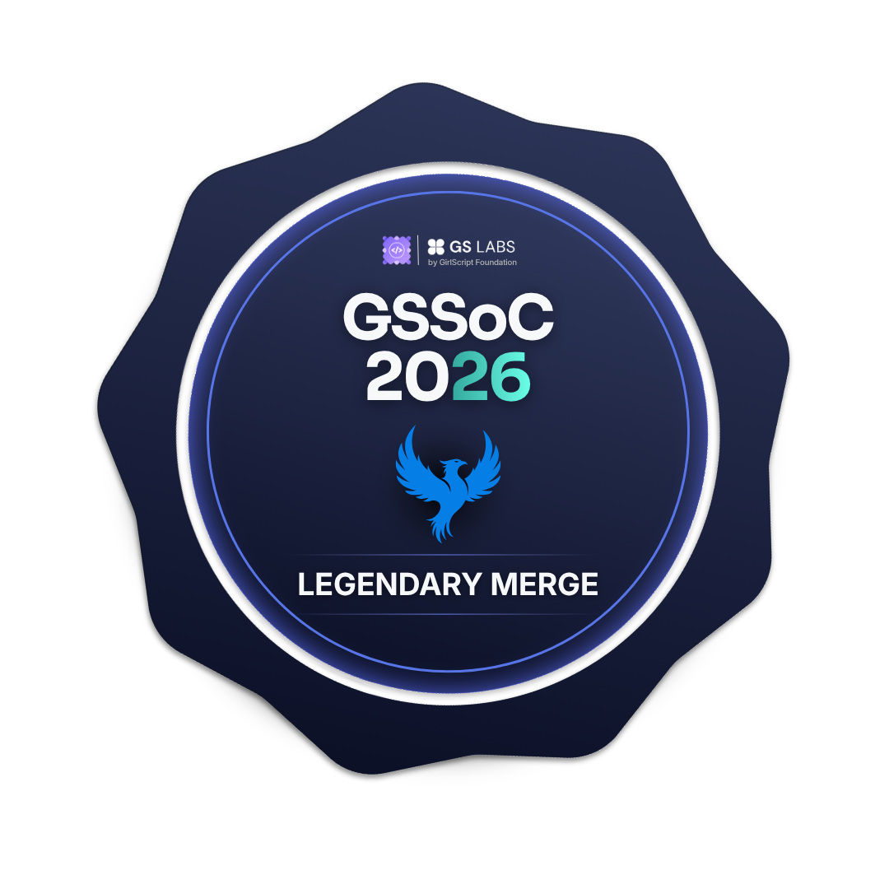
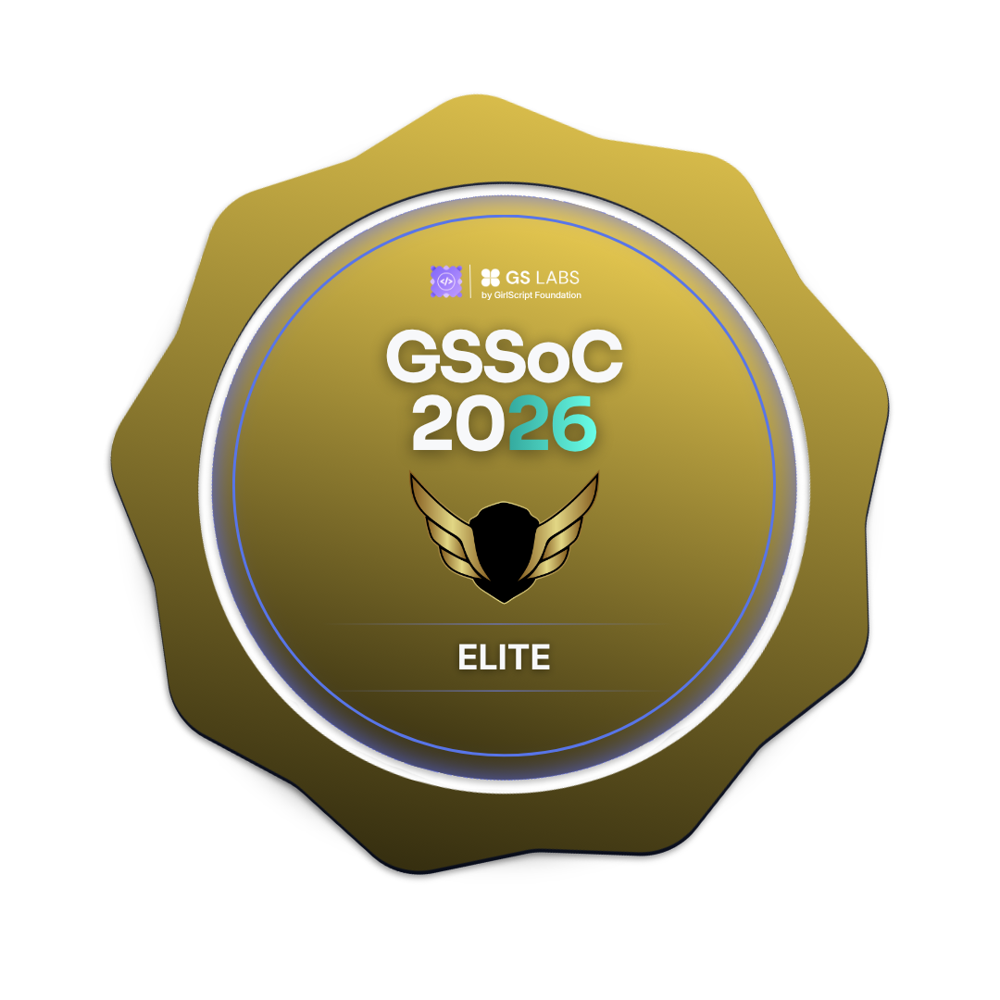

<!-- Animated Header -->

<h1 align="center">Hi , I'm Vidheendu</h1>
<h3 align="center"> Full Stack Developer |  Open Source Contributor |  Learning Everyday</h3>

<!-- Typing Animation -->

  

<!-- Profile Views -->

  

<!-- Animated Divider -->

  

🌟 About Me

-  Currently learning **Full Stack Development & AI**
-  Interested in **Real-world Projects**
-  Ask me about **JavaScript, Git, APIs, Next.js**
-  Reach me: **vidheendu01@gmail.com**
-  Fun fact: *I commit bugs faster than I fix them.*

---
# 🏆 GSSoC 2026 Achievements

  
  
  
  
  

  
  
  
  
  

--- 
# 🚀 My Tech Arsenal

  
  

# 📈 Contribution Activity

--- 

# 🌐 Connect with Me

  

  

  

---

<!-- Animated Footer -->

  <i>"Code. Learn. Build. Repeat."</i>

<h3 align="center">⭐️ Thanks for visiting my profile ⭐️</h3>
